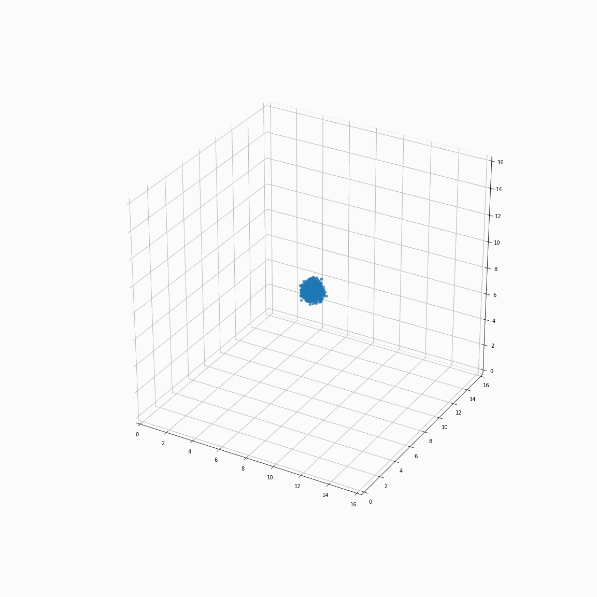

# Gravity-on-a-Mesh
This is a final group project for Computational Physics.  
This project focuses on solving Poisson’s equation on a uniform mesh. It involves a technique known as particle-mesh which is often used in the context of simulating the formation of structure in the universe and in other contexts.  
The simulation starts at some initial time step with some initial conditions for the particles. The density field is
approximated by counting the number of particles in each cell of a rectangular mesh. This yields
a 3D array containing the density field. Then, Poisson’s equation is solved for the gravitational
potential. The acceleration on each particle can then be calculated as the gradient of the potential.
The velocity of the particle is updated, and its position is updated according to the velocity. Then
the process is repeated with the new (slightly different) density field. The basics of this method
were described thoroughly in a classic book by Hockney & Eastwood (1988), Computer Simulation
Using Particles.

# 16 random particles

# 32 random particles

